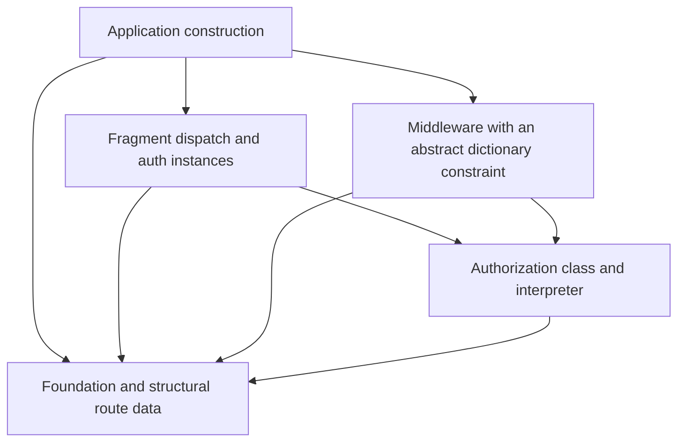

# Leaf route dictionaries for ordinary Yesod middleware

Status: design proposal, 2026-09-16, against `a753bdf7`. No production behavior
changes are implemented here. A temporary executable prototype checked the core
types, middleware behavior, and isolated nested dispatch.

## Proposed direction

Generate a typed, leaf-only view of the route that Yesod already matched. Use
prairie's generic dictionary-instance pattern to recover a caller-chosen
constraint for that leaf's owning fragment. Ordinary middleware can then invoke
exactly that fragment's authorization policy.

This supports the intended dependency model: authorization depends on the
selected fragment, with all its ancestor captures available as `ParentArgs`.
Delegating route constructors do not enter the authorizer, and fragments that
only delegate need no authorization instance.

There are two distinct pieces of work. Yesod needs structural route reflection
and dictionary recovery, with no user-supplied TH authorization hook. The
application may need to refactor authorization that currently performs checks
while recursively descending through parent routes. Reflection cannot preserve
those checks automatically while also eliminating nested authorization.

Claude's local `RUNTIME-DISPATCH-DESIGN.md` proposes a broader dispatch redesign.
The witness/dictionary idea can be used independently: the current runner sets
`Maybe (Route site)` before calling `yesodMiddleware`, and `getCurrentRoute`
already exposes it. This proposal needs neither another path matcher nor a
change to what `YesodDispatchNested` returns.

## Remove delegation constructors from the authorizer's input

Consider the mixed fragment:

```haskell
data MyRouteR
    = SubrouteR OtherRouteR
    | MyEndpointR
```

A deepest-fragment lookup returning ordinary `MyRouteR` promises that the value
is `MyEndpointR`. Its type still admits `SubrouteR`, so an exhaustive authorizer
needs a delegation or error case that should never execute. A newtype around
`MyRouteR` does not remove that constructor from the underlying sum.

Instead, generate a separate view containing only constructors owned directly
by the fragment:

```haskell
class RenderRouteNested r => HasRouteLeaf r where
    data RouteLeaf r
    fromRouteLeaf :: RouteLeaf r -> r

instance HasRouteLeaf MyRouteR where
    data RouteLeaf MyRouteR = MyEndpointLeaf
    fromRouteLeaf MyEndpointLeaf = MyEndpointR
```

The original route type and handler signatures remain intact. A real endpoint's
captures appear in its leaf constructor; `ParentArgs r` continues to hold the
captures consumed before entering the fragment. `fromRouteLeaf` permits ordinary
route rendering or other APIs that need the original fragment.

The application-owned class becomes:

```haskell
class (HasRouteLeaf r, ParentSite r ~ App) => AuthorizeRoute r where
    isAuthorized :: ParentArgs r -> RouteLeaf r -> AuthPolicyStyleWrapper

instance AuthorizeRoute MyRouteR where
    isAuthorized args MyEndpointLeaf = myEndpointPolicy args
```

There is no `SubrouteR` case to fill in. An `OtherRouteR` endpoint goes directly
to its own instance. If a fragment has only delegation constructors, generate no
leaf witness for it and require no authorization dictionary for it. A root
route containing direct endpoints needs an instance for those endpoints;
a root that only groups child fragments does not.

This changes the proposed application class's input from `r` to `RouteLeaf r`.
Keeping the exact original input type means retaining the unwanted constructors.
Another possible API puts the class on the generated leaf type itself, with
corresponding `ParentArgs`/`ParentSite` instances; the essential requirement is
that its input type exclude delegation constructors. Names are provisional.

## Reuse the generic FieldDict instance

Prairie's relevant local API is `FieldDict`. Its generator emits an instance
polymorphic in the requested constraint, with a context requiring that constraint
for each field type. The instance can live with data declarations without
importing any particular policy class. Concrete dictionaries are supplied when
it is used. See the inspected
[class definition](https://github.com/parsonsmatt/prairie/blob/029bfcbb9df385edc434c1f1b44631e548ec7d2c/src/Prairie/Class.hs#L346),
[generator](https://github.com/parsonsmatt/prairie/blob/029bfcbb9df385edc434c1f1b44631e548ec7d2c/src/Prairie/TH.hs#L359),
and the author's [explanation](https://www.parsonsmatt.org/2020/10/13/unpack_your_existentials.html).

Use the same approach for endpoint-owning fragments:

```haskell
data Dict (c :: Constraint) where
    Dict :: c => Dict c

data family Subroute root :: Type -> Type

class SubrouteDict (c :: Type -> Constraint) root where
    getSubrouteDict :: Subroute root r -> Dict (c r)

-- Generated with the route data; no authorization imports.
-- This example's root only groups these two fragments.
data instance Subroute (Route App) r where
    MyRef    :: Subroute (Route App) MyRouteR
    OtherRef :: Subroute (Route App) OtherRouteR

instance (c MyRouteR, c OtherRouteR)
    => SubrouteDict c (Route App) where
    getSubrouteDict MyRef    = Dict
    getSubrouteDict OtherRef = Dict
```

`Dict` is the usual constraint witness, defined here for completeness. The actual
library could reuse an existing definition. `SubrouteDict` is a working name for
the sum-oriented counterpart of `FieldDict`.

There is no optional instance registry or instance reification. Missing a
required instance is a compile-time error where the concrete
`SubrouteDict c (Route App)` dictionary is needed. Pattern matching the witness
recovers evidence from that dictionary. Pure delegation fragments do not occur
in its generated context because they cannot be selected as endpoint owners.

## Project once, then visit with the chosen constraint

A generated projection walks the already matched route value to its endpoint:

```haskell
class RenderRoute site => RouteLeaves site where
    routeLeaf :: Route site -> SomeRouteLeaf site

data SomeRouteLeaf site where
    SomeRouteLeaf
        :: (HasRouteLeaf r, ParentSite r ~ site)
        => Subroute (Route site) r
        -> ParentArgs r
        -> RouteLeaf r
        -> SomeRouteLeaf site
```

For example, a matched `OrgR 42 (AccountR "alice" (ItemR 7))` produces an account
witness, parent arguments `(42, "alice")`, and `ItemLeaf 7`. It does not produce
a list of policies to execute. Unit, single-capture, and tuple `ParentArgs`
conventions remain unchanged; multipieces remain in the endpoint's leaf value.

The middleware helper can have the requested callback-oriented shape:

```haskell
getDeepestSubrouteWithInstance
    :: forall c site a.
       (RouteLeaves site, SubrouteDict c (Route site))
    => (forall r.
           (HasRouteLeaf r, ParentSite r ~ site, c r)
           => ParentArgs r -> RouteLeaf r -> HandlerFor site a)
    -> HandlerFor site (Maybe a)
getDeepestSubrouteWithInstance callback = do
    current <- getCurrentRoute
    case current of
        Nothing -> pure Nothing
        Just route ->
            case routeLeaf route of
                SomeRouteLeaf witness args leaf ->
                    case getSubrouteDict @c witness of
                        Dict -> Just <$> callback args leaf
```

The caller chooses `c`, such as `@AuthorizeRoute` or `@DescribeRoute`; the matched
route determines `r`. Thus `forall r` belongs inside the callback argument, using
GHC's [higher-rank argument types](https://ghc.gitlab.haskell.org/ghc/doc/users_guide/exts/rank_polymorphism.html).
`HasRouteLeaf r` supplies `RenderRouteNested r`, and `ParentSite r ~ site` connects
the recovered fragment to the handler's site.

Here `Maybe` means there may be no matched route. It does not mean that an
instance might be absent, and there is no search for an ancestor fallback.
`withCurrentRouteLeaf` might communicate the final API better than “deepest
subroute with instance.”

These definitions use `ConstraintKinds`, `FlexibleContexts`, `GADTs`,
`KindSignatures`, `MultiParamTypeClasses`, `RankNTypes`, `ScopedTypeVariables`,
`TypeApplications`, and `TypeFamilies`. Generated instances also use
`FlexibleInstances` and `UndecidableInstances`.

## Normal middleware and the dictionary construction boundary

The class can retain `AuthPolicyStyleWrapper` as its result. An application
adapter interprets the chosen policy and enforces the result before continuing:

```haskell
authorizationMiddleware
    :: SubrouteDict AuthorizeRoute (Route App)
    => HandlerFor App a -> HandlerFor App a
authorizationMiddleware handler =
    defaultYesodMiddlewareNoAuthCheck $ do
        current <- getCurrentRoute
        case current of
            Nothing -> handler -- explicit policy for unmatched requests
            Just fullRoute -> do
                checked <- getDeepestSubrouteWithInstance @AuthorizeRoute
                    (requireLeafPolicy fullRoute)
                case checked of
                    Just () -> handler
                    Nothing -> permissionDenied "Missing current route"
```

`requireLeafPolicy fullRoute args leaf` denotes the application adapter: select
`isAuthorized args leaf`, run the existing interpreter, and enforce its result.
The full route is already available for interpreters that need it. Existing
`AuthResult` interpreters can use `dispatchAuthorizationCheck` for Yesod's
write classification and denial/login behavior; despite its name, that helper
can be called from middleware. `AuthPolicyStyleWrapper` is not assumed to be a
monad or given a new composition rule.

The generic dictionary instance belongs with route data, but *using*
`SubrouteDict AuthorizeRoute (Route App)` still requires all the concrete
endpoint-owner dictionaries. Resolving that constraint directly inside
`instance Yesod App` would recreate the original dependency problem. Putting it
in the `Yesod App` instance context moves the requirement to users of that
instance, including isolated dispatch; it does not remove the requirement.

Instead, assemble middleware where the application imports its concrete
fragment instances, then pass it into the foundation as a value:

```haskell
data App = App
    { appRequestMiddleware ::
          forall a. HandlerFor App a -> HandlerFor App a
    -- other existing fields
    }

instance Yesod App where
    yesodMiddleware handler = do
        app <- getYesod
        appRequestMiddleware app handler

-- In application construction:
-- App { appRequestMiddleware = authorizationMiddleware, ... }
-- Concrete dictionaries are captured in this function value.
```

This field's type mentions neither `AuthorizeRoute` nor `AuthPolicyStyleWrapper`,
avoiding a cycle when the latter depends on `App`. It changes the application's
own construction API, not an exported Yesod runtime record. An existing suitable
configuration boundary could serve the same purpose.



The production assembly needs all the policies it uses. A focused test must not
instantiate that full-site dictionary if it wants to exclude sibling policies.
It can instead inspect the same generated leaf projection, match its known
fragment witness, and invoke only that fragment's instance. Reject unexpected
witnesses in the focused application. This needs no hspec-yesod library change;
it is configuration of the application's injected middleware. A small reusable
focused visitor could package that pattern later.

## Authorization refactoring is part of adopting this model

Existing nesting may contain behavior, not just route plumbing:

```haskell
case route of
    SubrouteR arg child -> validate arg >> subrouteRIsAuthorized child
```

Deepest-only authorization deliberately skips that parent entry point.
`ParentArgs` makes `arg` available, but the child's policy must now invoke the
required validation itself, perhaps through a shared helper. The migration
should distinguish cases as follows:

| Existing behavior | Deepest-only policy |
| --- | --- |
| Parent only delegates | Remove the delegation from authorization; structural projection selects the child. |
| Parent validates a capture | Reuse that validation in each affected leaf policy through an explicit helper. |
| Parent conditionally delegates or changes the child environment | Refactor that behavior into the selected policy or shared policy combinator; a generic walk cannot infer it. |
| Fragment has both direct endpoints and child fragments | Authorize only its direct `RouteLeaf` constructors; children have their own instances. |

Do not preserve parent checks by automatically running every ancestor policy:
that restores authorization nesting and can double-run children while old
policies still delegate. Nor should an authorization denial trigger ancestor
fallback. The selected policy owns the complete decision for the endpoint.

A gradual migration can adapt an unmigrated leaf to the existing full-route
policy as an explicit fallback, invoking it once. That adapter still carries the
old global dependencies and is not the final isolation model. Migrated fragments
can become independent as their required ancestor checks move into their own
policies/shared helpers. Regression tests must cover denial of invalid parent
captures and conditional behavior, not just successful leaf requests.

## Boundaries and implementation scope

* Middleware becomes the sole enforcement point for migrated policies. Use
  `defaultYesodMiddlewareNoAuthCheck` to retain default headers without a second
  legacy check, and remove dispatch wrappers for those same policies. Preserve
  the existing interpreter's method classification, login, denial, and error
  behavior.
* A matched-path 405 has a route, so authorization can run first. An unmatched
  request needs an explicit application policy; the sample leaves the ordinary
  404 handler in charge.
* Direct nested dispatch reconstructs the full parent route for the runner.
  Projection therefore sees the same parent captures and endpoint. A focused
  test chooses the same leaf instance without assembling sibling dictionaries.
* A mount is a leaf boundary in the parent site's route tree. Its view should
  retain the parent mount's arguments and child route value, without descending
  into a different `ParentSite`. Mount code generation needs separate coverage.
  Subsite misses can supply no current route, so this API cannot recover mount
  captures on those misses or replace existing named mount checks on subsite
  404s.
* Raw WAI subsites that bypass the parent runner bypass parent middleware. The
  existing contract remains: every subsite on the path must honor that runner,
  including transitive mounts. TH cannot establish this for arbitrary code.

Generate leaf views, witnesses, the projection, and the constraint-polymorphic
instance from the existing route structure. No user authorization callback is
needed in TH, and data/dispatch can retain the same route options. Keep the
existing route ADTs, handler calling conventions, and dispatch protocol.

This adds generated types and constructor names; naming, export behavior, and
compile-time cost need evaluation. Parameterized sites whose compatibility mode
omits `RenderRouteNested` instances need a support decision. Focused and split
splices must not emit duplicate structural declarations. A direct projection is
linear in route depth and allocates a leaf view; performance is unmeasured.

The new reflection API can be explored additively. Existing users must retain
current behavior by default. Applications adopting leaf-only authorization opt
into the policy-input and wiring changes; this document does not propose a
breaking change to existing Yesod classes or exported runtime records.

## Prototype evidence and next step

A temporary multi-module prototype compiled against this branch using GHC 9.8.4,
`-Wall`, and `-Werror=incomplete-patterns`. It hand-wrote the structural instances
and used the existing `mkYesodData`, ordinary/focused dispatch, and normal
middleware with no authorization hook.

Nine checks passed: one pure lookup using another constraint (`DescribeRoute`)
and eight WAI requests covering parent captures, allow/deny ordering,
authorization before 405, unmatched 404, and full-site/direct nested dispatch.
The fixture had a purely delegating `OrgR` with **no authorization instance**.
Root and fragment policies matched only their leaf constructors, with no filler
cases for delegation.

A separate executable imported the account dispatcher and policy without root
dispatch, root authorization, or sibling authorization modules. It used the leaf
projection and a focused middleware adapter; all three nested allow/deny/405
requests passed. The foundation's polymorphic dictionary instance compiled
without any policy imports. Expected orphan-instance warnings remained for
instances kept outside the class/type modules.

These exploratory checks are outside the repository suite. Production TH
emission, full `AuthPolicyStyleWrapper` integration, preservation of existing
parent checks during migration, parameterized sites, multipieces, and mount
handling remain unimplemented or untested by this prototype.

The next useful experiment is one generated mixed fragment and one existing
parent/child policy pair. Move the parent's required validation into the leaf
policy, inject the middleware at application construction, and test parent
capture denial plus direct nested dispatch without sibling policy imports.
That tests both the structural abstraction and the necessary authorization
refactor before expanding the design.
